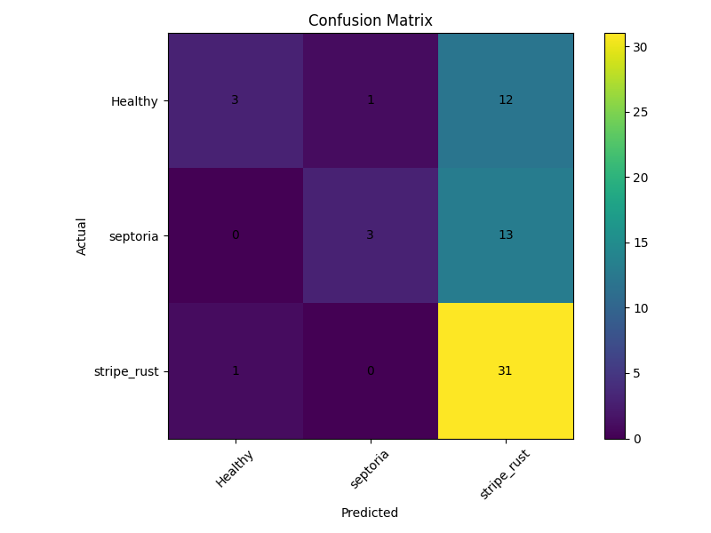

# 🌾 Early Wheat Disease Detection Using Deep Learning (PyTorch)

## 📌 Project Overview

This project implements an **Early Wheat Disease Detection system** using **ResNet-18**, a convolutional neural network pre-trained on ImageNet, with **transfer learning**. The system classifies wheat leaf images into three categories:

- **Healthy**
- **Septoria**
- **Stripe Rust**

The goal is to support early identification of wheat leaf diseases and assist timely agricultural intervention.

---

## 🎯 Objectives

- Detect wheat diseases from leaf images at an early stage
- Use a pre-trained CNN model to improve classification performance
- Apply image preprocessing and data augmentation techniques
- Evaluate the model using standard classification metrics
- Demonstrate a complete deep learning workflow using PyTorch

---

## 🧠 Model Architecture

- **Base Model:** ResNet-18
- **Pre-training:** ImageNet weights
- **Framework:** PyTorch
- **Approach:** Transfer Learning
- **Input Image Size:** 224 × 224 RGB images

### Transfer Learning Strategy

- The pre-trained convolutional layers of ResNet-18 were frozen.
- The final fully connected layer was replaced according to the number of wheat disease classes.
- Only the final classification layer was trained initially.

---

## 🛠️ Technology Stack

- **Programming Language:** Python
- **Deep Learning Framework:** PyTorch, TorchVision
- **Image Processing:** PIL, OpenCV
- **Data Handling:** NumPy
- **Visualization:** Matplotlib, Seaborn
- **Model Evaluation:** Scikit-learn

---

## 📂 Dataset

The dataset contains wheat leaf images categorized into healthy and diseased classes.

### Classes Used

| Class | Description |
|---|---|
| Healthy | Wheat leaves without visible disease symptoms |
| Septoria | Wheat leaves affected by Septoria disease |
| Stripe Rust | Wheat leaves affected by stripe rust disease |

### Dataset Source

Dataset: **Mendeley Dataset Repository**  
Link: https://data.mendeley.com/datasets/wgd66f8n6h/1

---

## 🧪 Methodology

### 1. Image Preprocessing

Each image was resized to **224 × 224 pixels** to match the input size required by ResNet-18.

Validation and test images were normalized using ImageNet normalization values:

```python
mean = [0.485, 0.456, 0.406]
std = [0.229, 0.224, 0.225]
```

### 2. Data Augmentation

To improve generalization, the following augmentation techniques were applied to the training images:

- Random horizontal flipping
- Random rotation
- Color jittering
- Normalization

### 3. Model Training

The model was trained using:

- **Loss Function:** CrossEntropyLoss
- **Optimizer:** Adam
- **Learning Rate:** 0.0001
- **Batch Size:** 32
- **Epochs:** 10

### 4. Model Evaluation

The trained model was evaluated using:

- Accuracy
- Precision
- Recall
- F1-score
- Confusion matrix

---

## 📊 Results

The model achieved a **best validation accuracy of 58.33%**.

### Classification Report

| Class | Precision | Recall | F1-Score | Support |
|---|---:|---:|---:|---:|
| Healthy | 0.75 | 0.19 | 0.30 | 16 |
| Septoria | 0.75 | 0.19 | 0.30 | 16 |
| Stripe Rust | 0.55 | 0.97 | 0.70 | 32 |
| **Accuracy** |  |  | **0.58** | 64 |
| **Macro Avg** | 0.68 | 0.45 | 0.43 | 64 |
| **Weighted Avg** | 0.65 | 0.58 | 0.50 | 64 |

---

## 📉 Confusion Matrix

The confusion matrix shows that the model performed well on the **Stripe Rust** class but struggled to correctly classify **Healthy** and **Septoria** images.



### Confusion Matrix Values

| Actual \ Predicted | Healthy | Septoria | Stripe Rust |
|---|---:|---:|---:|
| Healthy | 3 | 1 | 12 |
| Septoria | 0 | 3 | 13 |
| Stripe Rust | 1 | 0 | 31 |

---

## 🔍 Result Analysis

The model achieved moderate performance overall, with strong recall for the **Stripe Rust** class. However, the model showed poor recall for the **Healthy** and **Septoria** classes.

### Key Observations

- The model correctly identified **31 out of 32 Stripe Rust** samples.
- The model misclassified many **Healthy** and **Septoria** images as **Stripe Rust**.
- This indicates a class bias toward the Stripe Rust category.
- The overall accuracy was **58%**, which shows that the model needs improvement before practical deployment.

---

## ⚠️ Limitations

- The dataset appears imbalanced, with more Stripe Rust samples than the other classes.
- The model is biased toward predicting Stripe Rust.
- Healthy and Septoria classes have low recall.
- Only the final layer of ResNet-18 was trained, which may limit disease-specific feature learning.
- More training data and stronger validation are needed for reliable real-world use.

---

## 🚀 Future Improvements

- Use a balanced dataset or apply class weighting.
- Fine-tune deeper layers of ResNet-18, especially `layer4`.
- Increase the number of training epochs with early stopping.
- Use stronger augmentation techniques.
- Try other architectures such as EfficientNet, DenseNet, or MobileNetV2.
- Apply Grad-CAM for explainability and visual interpretation.
- Improve dataset quality by removing blurry, duplicate, or noisy images.

---

## 🧪 Sample Prediction

The trained model can predict a disease class for a single wheat leaf image using the saved model weights.

```python
prediction, confidence = predict_image("sample.jpg")
print(f"Prediction: {prediction}")
print(f"Confidence: {confidence:.2f}%")
```

---

## 💾 Model Saving

The trained model weights were saved using:

```python
torch.save(model.state_dict(), "wheat_disease_detection_pytorch.pth")
```

---

## 📚 Key Learnings

- Practical implementation of CNN-based image classification using PyTorch
- Use of transfer learning with ResNet-18
- Importance of image preprocessing and augmentation
- Evaluation using precision, recall, F1-score, and confusion matrix
- Understanding the impact of class imbalance on model predictions
- Need for validation and unbiased testing in deep learning projects

---

## 🤝 Acknowledgements

- **Mendeley Dataset Repository** for providing the wheat disease dataset
- **PyTorch and TorchVision communities** for open-source deep learning tools
- **Scikit-learn** for model evaluation utilities

---

## 📌 Conclusion

This project demonstrates a PyTorch-based wheat disease classification system using ResNet-18 and transfer learning. The current model shows promising performance for detecting Stripe Rust but requires further improvement for reliable classification of Healthy and Septoria classes.

The project provides a strong foundation for future development in agricultural disease detection using deep learning.
